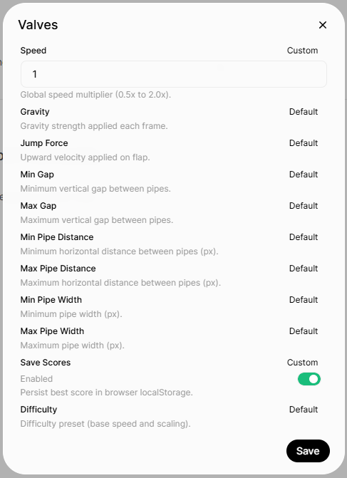
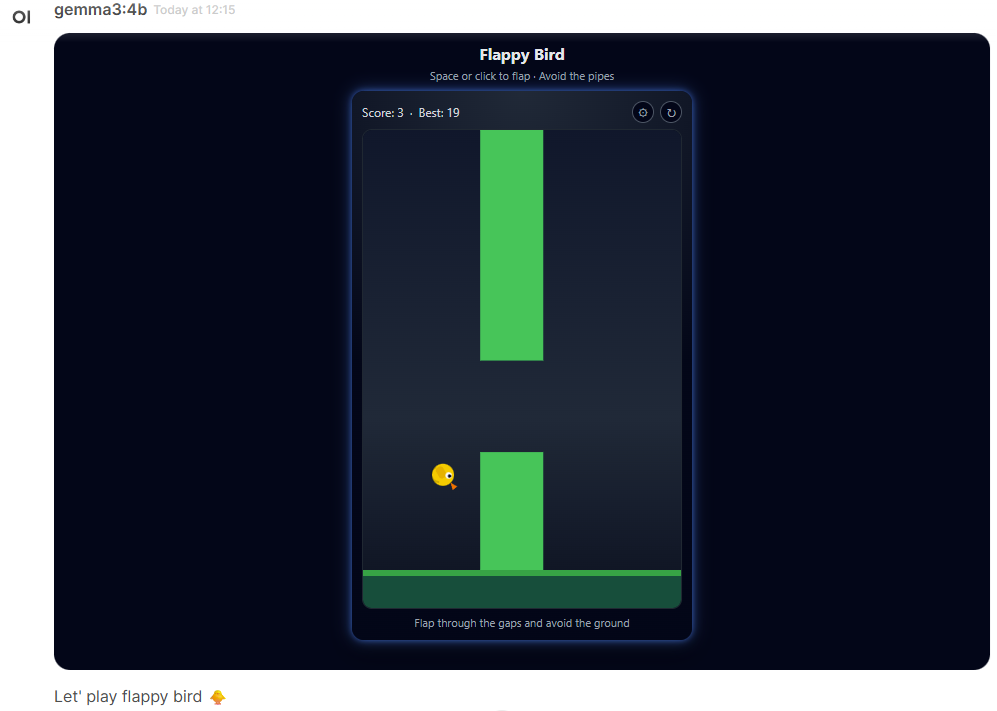
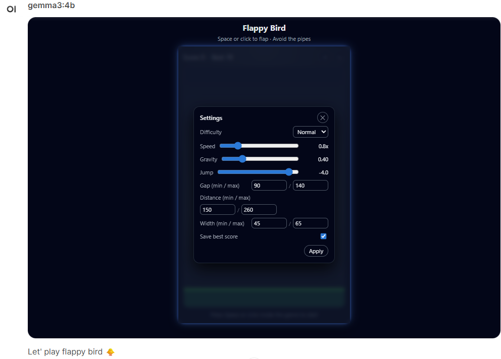

# 🐥 Flappy Bird Mini Game (OpenWebUI Tool)

A lightweight Flappy Bird–style mini game that runs directly inside **OpenWebUI** as a custom tool.  
Tap, flap, dodge the pipes, and chase a high score without leaving your chat.

---

## 🚀 Get started
1. Go to your open-webui **Workspace** then click on the **Tools** tab
2. Click on **New Tool** then **Import From Link**
3. Paste this url https://github.com/Helmi97/open-webui-extensions/blob/main/flapppy_bird/flapppy_bird.py then click **Import**

---

## ⚙️ Valves

Configurable per-tool in OpenWebUI:

| Valve               | Type    | Description |
|---------------------|---------|-------------|
| `speed`             | float   | Global speed multiplier (0.5–2.0). |
| `gravity`           | float   | Gravity strength per frame. |
| `jump_force`        | float   | Upward velocity on flap. |
| `min_gap` / `max_gap` | int  | Min / max vertical gap between pipes. |
| `min_pipe_distance` / `max_pipe_distance` | int | Min / max horizontal spacing between pipes (px). |
| `min_pipe_width` / `max_pipe_width` | int | Min / max pipe width (px). |
| `save_scores`       | bool    | Persist best score in browser localStorage. |
| `difficulty`        | enum    | Base speed & scaling (`easy`, `normal`, `hard`). |
---

## 🎮 Gameplay

- **Controls:**  
  - `Space` or **click** inside the game to flap  
- Avoid the pipes and the ground  
- Score increases each time you pass a pipe pair  
- Best score can be stored in `localStorage` (toggle in valves/settings)

---

## 🛠 In-Game Settings

A small **⚙️ gear icon** opens a settings modal where you can tweak:

- Difficulty  
- Speed, gravity, and jump strength  
- Pipe gap, distance, and width ranges  
- Save best score on/off  

Press **Apply** to restart with the new configuration.
