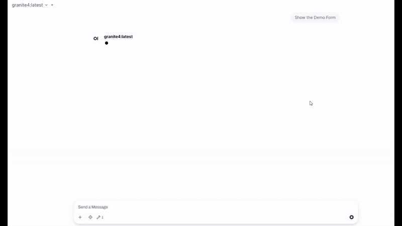

# Human Checkpoint

`human_checkpoint` is an Open WebUI Tool that lets the model request structured human input through a browser modal instead of another chat turn.

It takes a JSON Schema at runtime, renders the form with [Jedison](https://germanbisurgi.github.io/jedison-docs/) in the user's browser, waits for submit, cancel, or timeout, and returns a structured JSON result back to the tool call.

## Demo



## What It Does

- Uses `__event_call__` with `type: "execute"` so the browser runs the full modal flow.
- Loads Jedison from CDN on demand if it is not already present.
- Renders a modal dialog with title and description taken from the schema.
- Merges schema defaults with the configured `initial_data` valve before the form is shown.
- Disables submit while validation errors exist.
- Returns one of four structured results:
  - `{"status": "submitted", "data": {...}}`
  - `{"status": "cancelled"}`
  - `{"status": "timeout"}`
  - `{"status": "error", "message": "..."}`
- Cleans up the modal DOM, restores focus, and removes its event listeners when the interaction ends.

## Installation

1. Open Open WebUI as an admin.
2. Go to the Tools area.
3. Create or update a Workspace Tool with the contents of `human_checkpoint.py`.
4. Save it.
5. Configure the valves as needed.

## Valves

| Valve | Default | Purpose |
| --- | --- | --- |
| `submit_label` | `"Submit"` | Label for the primary action button. |
| `cancel_label` | `"Cancel"` | Label for the secondary action button. |
| `timeout_ms` | `240000` | Browser-side timeout in milliseconds. Use `0` to disable the tool timeout. |
| `initial_data` | `{}` | Static JSON object merged over schema defaults before rendering. |
| `ui_options` | `{}` | Extra Jedison options. Reserved keys such as `container`, `schema`, `theme`, and `data` are overwritten by the tool. |
| `css` | `""` | Extra CSS appended after the built-in modal styles. |
| `cdn_url` | `https://cdn.jsdelivr.net/npm/jedison@latest/dist/umd/jedison.umd.js` | URL used to load Jedison in the browser if needed. |
| `dialog_width` | `"92vw"` | CSS width for the dialog. |
| `dialog_max_width` | `"860px"` | CSS max-width for the dialog. |
| `theme_name` | `"default"` | Jedison theme: `default`, `bootstrap5`, `bootstrap4`, or `bootstrap3`. Bootstrap themes attempt to load matching CSS automatically. |
| `show_cancel_button` | `true` | Controls whether the cancel button is shown. |
| `close_on_escape` | `true` | Controls whether `Escape` cancels the dialog. |
| `close_on_overlay_click` | `false` | Controls whether clicking the backdrop cancels the dialog. |

## Customizing the Dialog

All dialog customization belongs in valves.

- The `schema` controls what the form asks for and how it validates.
- The valves control how the modal looks, behaves, and initializes.
- `initial_data` is merged over schema defaults before the form renders.
- `ui_options` is forwarded to Jedison, but reserved keys such as `container`, `schema`, `theme`, and `data` are always overwritten by the tool.
- The header countdown ring is shown only when `timeout_ms` is greater than `0`.

### Change Labels and Timeout

Use labels to match the action the user is taking, and use `timeout_ms` to control how long the modal stays open.

```json
{
  "submit_label": "Run Import",
  "cancel_label": "Not Now",
  "timeout_ms": 90000
}
```

This configuration:

- changes the primary action to `Run Import`
- changes the secondary action to `Not Now`
- keeps the dialog open for 90 seconds
- shows the countdown ring in the top-right corner

If you do not want the dialog to expire, disable the timeout entirely:

```json
{
  "timeout_ms": 0
}
```

That removes the browser-side timeout and hides the countdown ring.

**Note:**
- Open WebUI also has a server-side event-call timeout. The default is typically 300 seconds. If `timeout_ms` is larger than that server timeout, the server can fail the call before the browser-side timeout fires.

### Pre-Fill Known Data

Use `initial_data` when part of the form is already known from context and the user only needs to review or adjust it.

```json
{
  "initial_data": {
    "environment": {
      "region": "eu-central-1",
      "replicas": 4
    },
    "notification_channels": ["email", "slack"],
    "request_type": "deployment"
  }
}
```

This is especially useful for:

- editing an existing record
- re-running a workflow with the previous selections
- steering the user toward the most likely values without hard-coding them into every schema

### Control Size and Dismiss Behavior

Use the size and dismissal valves to make the modal feel appropriate for the task.

```json
{
  "dialog_width": "96vw",
  "dialog_max_width": "1100px",
  "show_cancel_button": true,
  "close_on_escape": true,
  "close_on_overlay_click": false
}
```

This is a good default for larger forms because it gives the content more room while still preventing accidental dismissal from backdrop clicks.

For stricter approval or checkpoint flows, you may want the modal to require an explicit action:

```json
{
  "show_cancel_button": false,
  "close_on_escape": false,
  "close_on_overlay_click": false
}
```

### Switch Themes and Pass Jedison Options

Use `theme_name` to switch the base Jedison rendering style, and use `ui_options` for additional Jedison behavior that should apply to all forms using this tool instance.

```json
{
  "theme_name": "bootstrap5",
  "ui_options": {
    "showErrors": "change"
  }
}
```

Available themes:

- `default`
- `bootstrap5`
- `bootstrap4`
- `bootstrap3`

Notes:

- Bootstrap themes attempt to load matching CSS automatically.
- The tool still wraps the form in its own modal shell, so the overall dialog layout remains consistent.
- Do not try to set `container`, `schema`, `theme`, or `data` inside `ui_options`; the tool always owns those values.

### Apply Custom CSS

Use the `css` valve when you want to adjust the modal shell or fine-tune Jedison field styling without changing the Python code.

Recommended targets:

- shell elements: `data-openwebui-human-checkpoint-*`
- Jedison internals: `.jedi-*`

Example CSS:

```css
[data-openwebui-human-checkpoint-dialog] {
  border-radius: 28px;
}

[data-openwebui-human-checkpoint-title] {
  letter-spacing: -0.03em;
}

[data-openwebui-human-checkpoint-dialog] .jedi-error-message {
  border-left: 4px solid rgba(220, 38, 38, 0.55);
}

[data-openwebui-human-checkpoint-dialog] .jedi-btn {
  text-transform: uppercase;
  letter-spacing: 0.04em;
}
```

Practical guidance:

- scope your selectors to `data-openwebui-human-checkpoint-*` so you do not accidentally affect the rest of Open WebUI
- prefer small overrides instead of replacing the entire visual system
- test both desktop and mobile after changing spacing or sizing

### Pin or Replace the Jedison CDN

If you want deterministic builds or an internal mirror, point `cdn_url` at a pinned version or your own hosted asset.

```json
{
  "cdn_url": "https://cdn.jsdelivr.net/npm/jedison@0.0.12/dist/umd/jedison.umd.js"
}
```

That is useful when:

- you want to avoid `@latest`
- you need reproducible behavior across environments
- your deployment requires an approved internal asset source

### Example Presets

Fast operational prompt:

```json
{
  "submit_label": "Continue",
  "cancel_label": "Stop",
  "timeout_ms": 60000,
  "dialog_max_width": "760px"
}
```

Large review form:

```json
{
  "dialog_width": "98vw",
  "dialog_max_width": "1200px",
  "timeout_ms": 0,
  "theme_name": "bootstrap5"
}
```

Strict approval gate:

```json
{
  "submit_label": "Approve",
  "show_cancel_button": false,
  "close_on_escape": false,
  "close_on_overlay_click": false,
  "timeout_ms": 300000
}
```

## Return Values

### Submitted

```json
{
  "status": "submitted",
  "data": {
    "host": "db.internal",
    "port": 5432,
    "username": "etl_user",
    "password": "secret",
    "ssl": true
  }
}
```

### Cancelled

```json
{
  "status": "cancelled"
}
```

### Timeout

```json
{
  "status": "timeout"
}
```

### Error

```json
{
  "status": "error",
  "message": "human_checkpoint requires an active Open WebUI browser session because it opens a client-side modal through __event_call__."
}
```
## Example Inputs

The examples below show complete runtime payloads for `human_checkpoint`.

### Minimal Confirmation

Use this pattern when the model only needs one validated confirmation before continuing.

```json
{
  "schema": {
    "title": "Confirm Destructive Action",
    "description": "Please confirm that the cleanup job should delete temporary files older than 30 days.",
    "type": "object",
    "properties": {
      "confirmed": {
        "title": "I understand this action cannot be undone",
        "type": "boolean",
        "const": true,
        "default": true,
        "x-format": "checkbox"
      }
    },
    "required": ["confirmed"]
  }
}
```

### Credentials and Connection Settings

Use this pattern when a workflow needs several related secrets and connection details at once.

```json
{
  "schema": {
    "title": "Database Credentials",
    "description": "Provide the connection settings for the import job.",
    "type": "object",
    "properties": {
      "host": {
        "title": "Host",
        "type": "string"
      },
      "port": {
        "title": "Port",
        "type": "integer",
        "default": 5432,
        "minimum": 1,
        "maximum": 65535
      },
      "database": {
        "title": "Database Name",
        "type": "string"
      },
      "username": {
        "title": "Username",
        "type": "string"
      },
      "password": {
        "title": "Password",
        "type": "string",
        "x-format": "password"
      },
      "ssl": {
        "title": "Use SSL",
        "type": "boolean",
        "default": true
      }
    },
    "required": ["host", "database", "username", "password"]
  }
}
```

### Date Range and Export Options

Use this pattern for report generation, search filters, and export setup.

```json
{
  "schema": {
    "title": "Export Request",
    "description": "Choose the report scope and delivery settings.",
    "type": "object",
    "properties": {
      "start_date": {
        "title": "Start Date",
        "type": "string",
        "x-format": "date"
      },
      "end_date": {
        "title": "End Date",
        "type": "string",
        "x-format": "date"
      },
      "format": {
        "title": "Export Format",
        "type": "string",
        "enum": ["csv", "xlsx", "json"],
        "default": "csv"
      },
      "delivery": {
        "title": "Delivery Method",
        "type": "string",
        "enum": ["download", "email", "shared_folder"],
        "default": "download"
      },
      "include_archived": {
        "title": "Include Archived Rows",
        "type": "boolean",
        "default": false
      }
    },
    "required": ["start_date", "end_date", "format", "delivery"]
  }
}
```

### Complex Deployment Checkpoint

Use this pattern when the model needs a larger, structured checkpoint with nested objects, arrays, and constrained choices.

```json
{
  "schema": {
    "title": "Deployment Approval",
    "description": "Complete the release checkpoint before production rollout begins.",
    "type": "object",
    "properties": {
      "environment": {
        "title": "Environment",
        "type": "string",
        "enum": ["staging", "production"],
        "default": "production"
      },
      "change_window": {
        "title": "Change Window",
        "type": "string",
        "x-format": "datetime-local"
      },
      "strategy": {
        "title": "Rollout Strategy",
        "type": "string",
        "enum": ["canary", "blue-green", "rolling"],
        "default": "canary"
      },
      "notification_channels": {
        "title": "Notification Channels",
        "type": "array",
        "uniqueItems": true,
        "items": {
          "type": "string",
          "enum": ["email", "slack", "sms"]
        },
        "default": ["email", "slack"],
        "x-format": "checkboxes-inline"
      },
      "approvers": {
        "title": "Approvers",
        "type": "array",
        "minItems": 1,
        "x-format": "table-object",
        "items": {
          "type": "object",
          "properties": {
            "name": {
              "title": "Name",
              "type": "string"
            },
            "email": {
              "title": "Email",
              "type": "string",
              "format": "email",
              "x-format": "email"
            },
            "role": {
              "title": "Role",
              "type": "string",
              "enum": ["owner", "security", "observer"],
              "default": "owner"
            }
          },
          "required": ["name", "email", "role"]
        }
      },
      "checks": {
        "title": "Pre-Launch Checks",
        "type": "object",
        "properties": {
          "smoke_tests_passed": {
            "title": "Smoke tests passed",
            "type": "boolean",
            "default": false
          },
          "rollback_ready": {
            "title": "Rollback plan ready",
            "type": "boolean",
            "default": true
          },
          "customer_notice_sent": {
            "title": "Customer notice sent",
            "type": "boolean",
            "default": false
          }
        },
        "required": ["smoke_tests_passed", "rollback_ready"]
      }
    },
    "required": ["environment", "change_window", "strategy", "approvers", "checks"]
  }
}
```
