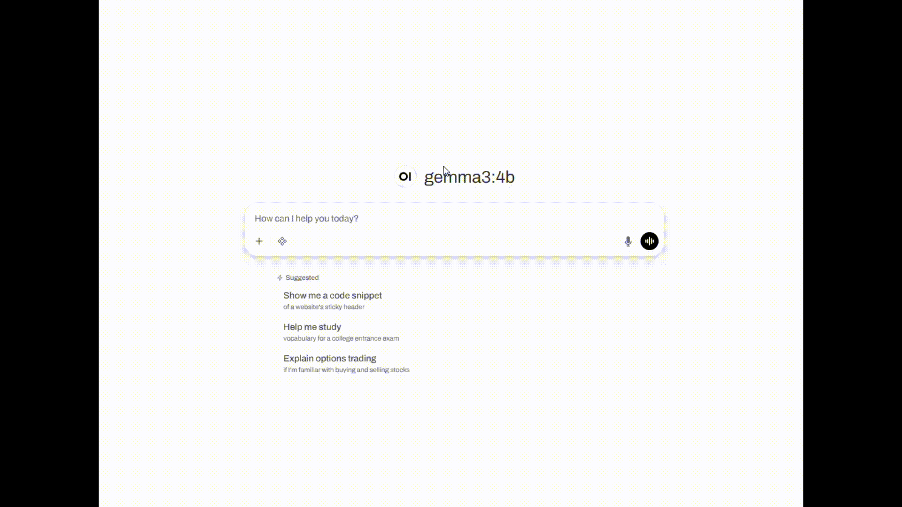
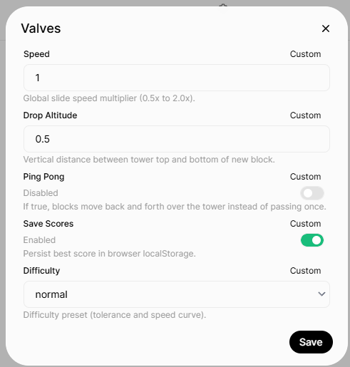
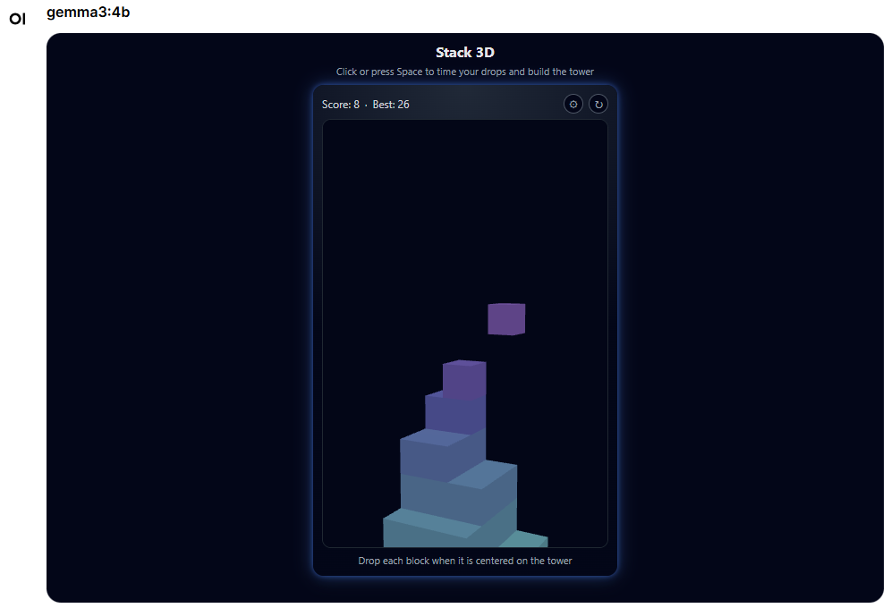
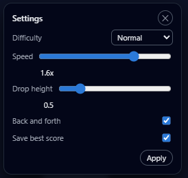

# 🧱 Stack 3D Mini Game (OpenWebUI Tool)

A sleek and satisfying 3D stacking game built directly into **OpenWebUI**.  
Time your drops, align each block perfectly, and build the tallest tower you can.

---

## 🚀 Get started
1. Go to your open-webui **Workspace** then click on the **Tools** tab  
2. Click **New Tool** → **Import From Link**  
3. Paste this URL and click **Import**:  
   https://github.com/Helmi97/open-webui-extensions/blob/main/stack3d/stack3d.py

---

## ⚙️ Valves  

Configurable per-tool in OpenWebUI:

| Valve                 | Type    | Description |
|-----------------------|---------|-------------|
| `speed`               | float   | Horizontal travel speed of blocks. |
| `drop_altitude`       | float   | Height from which new blocks spawn relative to tower top. |
| `back_and_forth`      | bool    | Whether blocks oscillate or pass once. |
| `save_scores`         | bool    | Store best height in localStorage. |
| `difficulty`          | enum    | Tolerance & precision (`easy`, `normal`, `hard`). |

---

## 🎮 Gameplay  

- **Controls:**  
  - `Space` or **click** to drop a block  
- Align the block as closely as possible to the tower  
- Perfect alignment keeps your tower wide  
- Miss too far and the tower collapses  
- Score increases with every successful layer

---

## 🛠 In-Game Settings  

Change gameplay behavior at any time through the **⚙️ settings modal**:

- Drop altitude  
- Block movement mode  
- Speed and difficulty  
- Save-score toggle  

Press **Apply** to rebuild the world with your new configuration.
