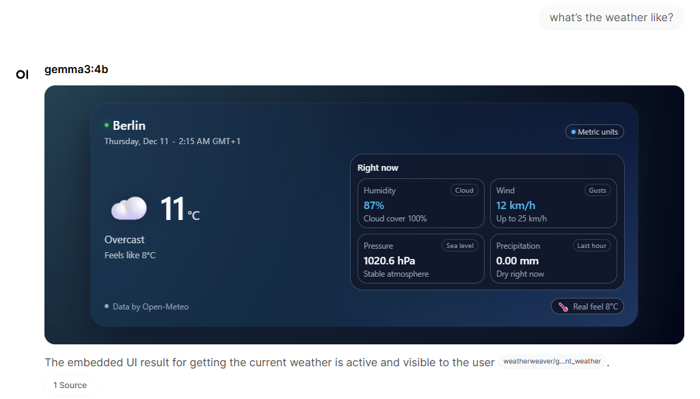
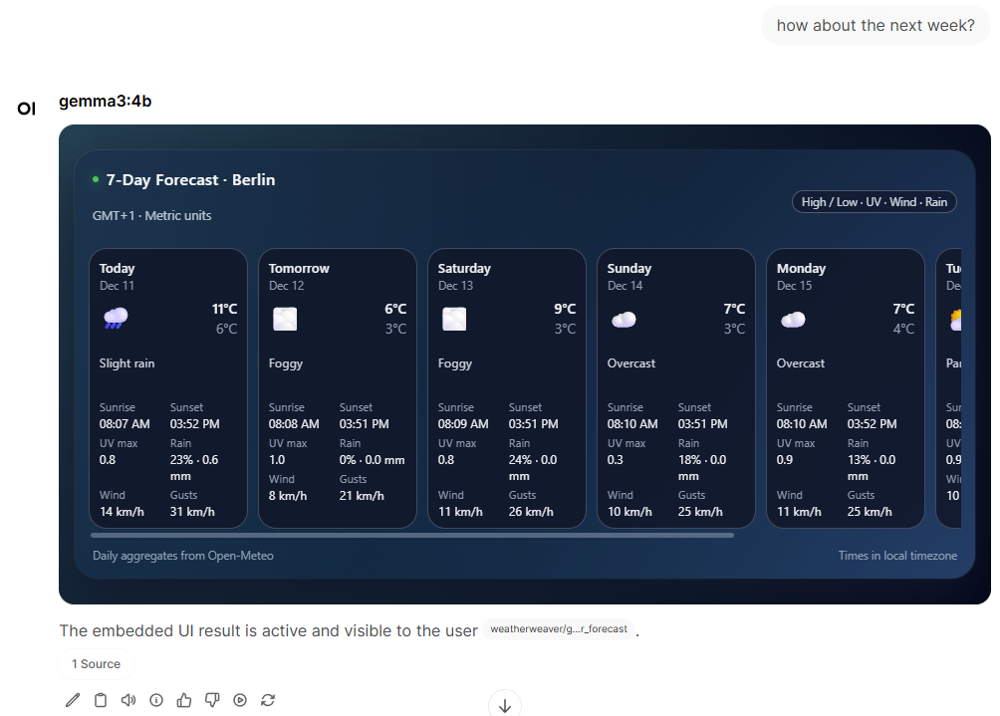

# Weather Tool

Enhanced weather tool for Open WebUI that shows a **modern responsive widget** for current conditions and a **multi day forecast**, powered by [Open-Meteo](https://open-meteo.com) (no API key needed).

## Features

- Beautiful HTML widgets rendered directly in the chat using Open WebUI Tools
- Current conditions with:
  - Temperature and feels like
  - Humidity and cloud cover
  - Wind speed, gusts and pressure
  - Precipitation in the last hour
- 1 to 16 day forecast with:
  - High and low temperatures
  - Condition icon and summary
  - Sunrise and sunset times
  - UV index
  - Precipitation probability and totals
  - Max wind and gusts
- Metric or imperial units with user overrides
- Uses Open Meteo geocoding and forecast APIs  
- No API keys 

## Installation

1. Go to your open-webui **Workspace** then click on the **Tools** tab  
2. Click **New Tool** → **Import From Link**  
3. Paste this URL and click **Import**:  
   https://github.com/Helmi97/open-webui-extensions/blob/main/weather_tool/weather_tool.py

## Credits

Based on:

- **Keyless Weather** by `spyci`
- **WeatherWeaver** by `PureGrain` at SLA Ops, LLC  
  <https://github.com/PureGrain/my-openwebui/tree/main/tools/weatherweaver>
